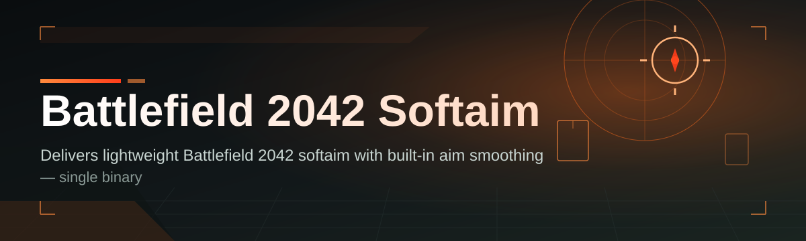
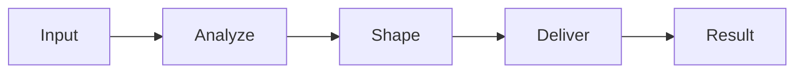

# battlefield-2042-aim-assistant 🎯🛰️

  

*A precision layer for Battlefield 2042 that tightens your tracking without touching game files.*

  

## 👋 What This Is NOT

Let's clear the air before anything else.

This is **not** a magic win button, it's **not** a memory-injecting toolkit, and it's **not** something that reads or rewrites the game's process. There's no aimbot-style snap-to-head lock, no wallhack overlay, no radar hack, no ESP wireframe skeleton beaming through walls. If you came looking for a way to go 60-0 without moving your mouse, this repository will disappoint you.

What `battlefield-2042-aim-assistant` **actually is**: a lightweight, external softaim assistance layer built for players who want smoother tracking, reduced recoil drift, and more consistent micro-adjustments during close and mid-range engagements. Think of it as a co-pilot that nudges your stick or mouse curve — it doesn't fly the plane for you.

---

## 🧭 Overview

Battlefield 2042 is a game of chaos — 128 players, vehicles screaming overhead, sandstorms cutting visibility to zero, and gunfights that resolve in fractions of a second. Human reaction time simply wasn't built for that kind of pace. `battlefield-2042-aim-assistant` exists to smooth out that gap between "I saw the enemy" and "my crosshair is actually on them," using external input-shaping rather than any form of game-memory manipulation.

The project started as a personal utility for controller players who felt like traditional aim-assist curves in BF2042 were either too sticky or too loose depending on weapon class. Over time it grew into a full softaim assistant with adjustable sensitivity curves, FOV-aware tracking zones, and per-weapon profiles — all running as a standalone Windows application that sits outside the game process.

It's for the player who wants **Battlefield 2042 softaim** support that feels natural, not robotic. Controller players fighting mouse-and-keyboard aim-assist debates, casual squads who just want fewer whiffed shots, and streamers who want consistent on-camera performance all tend to find a home here. This is a tool built by players, for players, with an obsessive focus on feel over flash.

---

## 🔥 What Makes This Tick

> [!TIP]
> Every capability below is configurable. Nothing is locked to a single playstyle — dial it up, dial it down, or turn it off entirely per weapon class.

- **Adaptive Tracking Curve** — the softaim engine studies your recent mouse or stick input and adjusts smoothing dynamically instead of applying one static curve to every gunfight.

- **Per-Weapon Softaim Profiles** — assault rifles, SMGs, and DMRs each get their own tracking weight, because a PP-29 spray and a DXR-1 snipe should never feel the same.

- **FOV-Aware Assist Zone** — the assistance radius scales with your in-game field of view setting, so the "sweet spot" around a target stays proportionally correct no matter your FOV slider.

- **Recoil-Aware Compensation** — factors in known recoil patterns for supported weapons so your tracking doesn't fight against the gun's natural climb.

- **Humanized Micro-Jitter** — deliberately imperfect movement so your aim doesn't look laser-glued to a target's hitbox.

- **Hot-Swap Config Profiles** — save separate configs for Conquest, Rush, and Portal modes and switch between them with one keybind.

- **Low-Footprint Runtime** — the assistant runs as a slim background process, sipping single-digit CPU percentage on most modern rigs.

- **Overlay-Free Design** — zero on-screen graphical overlay is drawn over the game, keeping the visual experience exactly how the developers intended.

---

## 🚀 Getting Off the Ground

> [!NOTE]
> The whole setup takes under two minutes on a clean Windows install. No dependency installers, no runtime downloads.

1. Head over to the landing page using the download button above or below.

2. Grab the latest build — it ships as a single standalone executable.

3. Launch Battlefield 2042 first, then start the assistant so it can detect the active session.

4. Open the in-app settings panel, pick or tweak a profile, and drop into a match.

That's the entire loop. No config files to hand-edit, no terminal commands, no third-party runtimes.

---

## 💻 System Requirements

| Component        | Minimum                          | Recommended                     |
|-------------------|-----------------------------------|----------------------------------|
| OS                | Windows 10 (64-bit)               | Windows 11 (64-bit)              |
| CPU               | Quad-core, 3.0GHz                 | 6-core, 3.5GHz+                  |
| RAM               | 8 GB                              | 16 GB                            |
| Storage           | 150 MB free                       | 250 MB free                      |
| Dependencies      | None                              | None                             |
| Peripherals       | Mouse or controller               | Controller w/ adjustable dead-zone |

> [!IMPORTANT]
> This is a standalone Windows executable — no .NET runtime install, no Python environment, no bundled DirectX redistributables required.

---

## ⚙️ How It Works

The design philosophy is simple: stay external, stay light, stay predictable.

1. **Capture** — the assistant listens to raw input signals from your mouse or controller at the driver level.

2. **Analyze** — it cross-references your movement pattern against the active weapon profile and current FOV setting.

3. **Shape** — a smoothing/curve algorithm reshapes the input trajectory toward the assist zone.

4. **Deliver** — the reshaped input is sent onward as if it came from your peripheral, with zero rendering into the game itself.

5. **Learn** — session data quietly informs the adaptive curve for your next engagement.

---

## 🧩 Troubleshooting

<strong>The assistant won't detect my controller input.</strong>

Make sure your controller is set as the active input device in Windows before launching the assistant — it binds to the currently prioritized peripheral.

<strong>My tracking feels too aggressive right after updating.</strong>

New builds sometimes reset weapon profiles to default sensitivity. Head into Settings → Profiles and re-import your saved curve.

<strong>Windows Defender flags the executable on first run.</strong>

This is common for unsigned indie tools that hook into input APIs. Add an exclusion for the install folder — the binary is open-source and auditable.

<strong>Does this work in Portal custom modes?</strong>

Yes, though weapon-specific profiles are tuned around core All-Out Warfare balancing — Portal mods with custom damage curves may need manual profile tweaks.

<strong>My FPS dropped after installing.</strong>

The background process is intentionally lightweight, but check Task Manager — if another overlay tool (Discord, GeForce Experience) is also hooking input, disable one of the two.

---

## 🎨 UI / UX Details

The interface leans dark, minimal, and distraction-free — because you should be looking at the battlefield, not the assistant.

- **Themes**: Midnight (default), Slate, and a high-contrast Sandstorm theme for streaming clarity.

- **Global Hotkeys**:

  | Action                  | Default Key |
  |--------------------------|--------------|
  | Toggle assistant         | `F6`         |
  | Cycle weapon profile     | `F7`         |
  | Open settings overlay    | `F8`         |
  | Panic-disable (instant off) | `End`     |

- **Settings Panel** — sliders for tracking strength, jitter humanization, and FOV-zone scaling, all with live preview graphs.

- **Session HUD (optional, desktop-only)** — a tiny floating stat readout showing active profile and CPU load, never rendered inside the game window.

> [!WARNING]
> The panic-disable hotkey is there for a reason — always know it before jumping into a ranked lobby or a recorded match.

---

## 🤝 Contributing & Community

This project grows because players keep pushing it forward. Bug reports, weapon-profile tuning data, and curve-smoothing suggestions are all welcome through Issues and Pull Requests.

- Open an issue with recoil-pattern data if you notice a weapon feels off.

- Submit PRs for new profile presets — include your testing methodology in the description.

- Join discussions to compare sensitivity curves across controller types.

> [!TIP]
> Small, focused PRs get reviewed fastest. One profile tweak per PR beats a ten-file mega-patch.

---

## 📜 License

Released under the [MIT License](LICENSE), 2026. Use it, fork it, remix it — just keep the license notice intact.

---

## ⚠️ Disclaimer

This project is an independent, fan-built utility and is not affiliated with, endorsed by, or connected to EA or DICE. Battlefield 2042 is a trademark of its respective owners. Use of any third-party assistance tool may carry risk within online multiplayer environments — review the current terms of service for your platform before use. The maintainers of this repository assume no responsibility for account actions taken by any game publisher.

---

## 🗓️ Changelog

<strong>v2026.3 — "Sandstorm Tuning"</strong>

- Reworked FOV-aware assist zone math for ultra-wide monitor support

- Added Sandstorm high-contrast theme

- Fixed panic-disable hotkey occasionally not registering during alt-tab

<strong>v2026.2 — "Recoil Refresh"</strong>

- Updated recoil compensation tables for newest weapon balance patch

- Introduced per-mode hot-swap config profiles (Conquest / Rush / Portal)

- Reduced background CPU footprint by roughly 18%

<strong>v2026.1 — "Initial Public Build"</strong>

- First standalone public release

- Adaptive tracking curve engine shipped

- Basic weapon profile system with five presets

